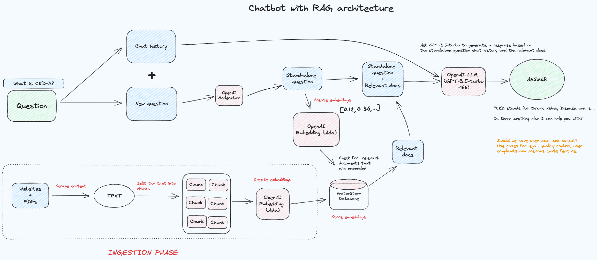

# rag-chatbot
This repo is a stripped down version of a RAG chatbot I worked on and deployed. It can be used as a template to launch similar things. The basic arch can be seen [here](./rag-chatbot-arch.excalidraw.png) or below.

It is a fictitious chatbot called "GastroGuru", a bot that can suggest recipes based on ingredients you have at home, dietary restrictions, or desired cuisine. It can fetch recipes from a vast PSQL vector database of chunked and embedded information (see [Ingestion Phase repo](https://github.com/Millmer/rag-ingestion-template)), offering cooking tips and alternatives for missing ingredients.

This repo contains the Backend API and Svelte Frontend for serving the Chatbot. We receive and respond to the user requests by streaming the OpenAI responses using `Socket.io`.

If interested, see the [logs analysis repo](https://github.com/Millmer/rag-chatbot-logs-analysis-notebook), using statistical techniques to cluster the types of questions asked to gain a better understanding of the user's usage of the bot.

Currently, it is set to using the OpenAI model `gpt-3.5-turbo-16k` for chat completion. In production, you can use whatever model best fits your needs.
**_Note:_** If you use a fine-tuned model, be sure to include its token limits in the backend config.

### Suggested improvments
- ~~Clean up Socket.io application architecture (it's getting a bit messy)~~
  - ~~Add middlewares and libs to refactor common functions~~
- Add a Redis DB to manage sessions/chats and keep hold of other things like chat history (although AssitantsAPI would solve that, would still need something like Redis to match userIDs to generated threads, could use a simple sqlite on the server as well)
- ~~Add TTS (for fun)~~
  - Ideally should Stream Audio Over HTTP for better performance
    - On `chat:speak` we save the generated audio file somewhere like S3
    - Provide signedURL back to FE
    - FE streams/downloads audio from the returned URL to the user
  - Can we stream the audio directly from OpenAI before the file is finished?
- Migrate to new AssistantsAPI
  - What to do with the custom knowledge base then - upload to the assistant or somehow use custom RAG with the assistant?
- Incorporate better metrics logging with the deliberate structure instead of using basic std::out
- Collect feedback from users on responses (i.e. 👍 or 👎)
- Integrate proper evals to assess performance and effect of prompt-engineering & RAG changes ([ExplodingGradient Ragas](https://github.com/explodinggradients/ragas) or [OpenAI Eval](https://github.com/openai/evals))
  - With evals, experiment and improve prompt
  - With evals, improve on RAG relevance, document count and tokens
  - With evals, experiment with different chunkings
  - Experiment with HyDE as with these questions, we may match our documents better as they usually contain the answer rather than the question.
- Add CI/CD rather than manually run package.json scripts

## Backend Architecture

**_Note:_** The Ingestion Phase is part of the [rag-ingestion](https://github.com/Millmer/rag-ingestion-template) repo



_(Drawn in Excalidraw - use this [VSCode plugin](https://marketplace.visualstudio.com/items?itemName=pomdtr.excalidraw-editor) to modify in IDE)_

## Backend Run
```sh
cd backend
npm run dev
```

Ensure that you have a valid `.env.local` environment variables file. See the `.env.example` to see what you need.

## Backend Update
Sync local changes:
```sh
cd backend
npm run deploy:test
```

Go into the server and restart:
```sh
pm2 restart ecosystem.config.js
```

If `node_modules` changed, then be sure to do a fresh install on the server with:
```sh
cd chatbot
npm install
```

## Backend Setup
The chatbot is hosted inside a Digital Ocean droplet as it requires streaming/sockets to work and they're not compatible with AWS Lambda (atm).

To set up a new server we need to install the required software/packages/libraries:
- NodeJS v18 or greater
- npm
- pm2
- nginx (should be installed already due to OS config)

### Backend Setup Nodejs
Following [this setup](https://www.digitalocean.com/community/tutorials/how-to-install-node-js-on-ubuntu-22-04)

```sh
sudo apt update
sudo apt install nodejs
sudo apt install npm
```

### Backend Setup pm2
__Locally__
Copy the `ecosystem.config.js` across to your server:
```sh
scp ecosystem.config.js root@YOUR_IP_ADDRESS:/root
```

Sync the files with the deploy command:
```sh
cd backend
npm run deploy:test
```

__Inside the server__

First install the packages:
```sh
cd chatbot
npm install
cd ..
```

Then install and run `pm2`:
```sh
npm install pm2 -g
pm2 start ecosystem.config.js
```

For improved logging install the module [pm2-logrotate](https://github.com/keymetrics/pm2-logrotate) to automatically rotate and keep all the logs file using a limited space on disk.
```sh
pm2 install pm2-logrotate
```


### Backend nginx config for sockets
```
location /chatbot/ {
        proxy_set_header X-Forwarded-For $proxy_add_x_forwarded_for;
        proxy_set_header Host $host;

        proxy_pass http://localhost:3001;

        proxy_http_version 1.1;
        proxy_set_header Upgrade $http_upgrade;
        proxy_set_header Connection "upgrade";
}
```

## Postgres Database
Imagine the database lives in an EC2 server. To support Vector Search with the database, we need to install a plugin called `PG Vector`. We assume the following PG Version:

*__PG Version__: PostgreSQL 12.14 (Ubuntu 12.14-0ubuntu0.20.04.1) on x86_64-pc-linux-gnu, compiled by gcc (Ubuntu 9.4.0-1ubuntu1~20.04.1) 9.4.0, 64-bit*

### PG Vector Setup
The [PGVector plugin](https://github.com/pgvector/pgvector) (v0.4.1) is used to handle vector embeddings for the ChatBot.

To install the following dependencies were first installed:
```sh
sudo apt install make # Version 4.1.2
sudo apt-get install gcc # Version 9.4.0
sudo apt-get install postgresql-server-dev-12 # Matches PG Version
```

Then install the plugin
```sh
cd /tmp
git clone --branch v0.4.1 https://github.com/pgvector/pgvector.git
cd pgvector
make
make install # may need sudo
```

Once installed then log in to the PSQL instance and run:
```sql
CREATE EXTENSION vector;
```

And you're done! See the [docs](https://github.com/pgvector/pgvector) for more on how to create vector columns and use certain vector specific operations.

## Frontend Run
```
cd frontend
npm run dev
```

Ensure you have the correct `.env` variables.

If running the BE locally, the `PUBLIC_CHATBOT_API_URL=http://localhost:3001/chatbot`

## Frontend Deploy
Go inside the `frontend` folder and run the following command:
```
npm run deploy
```

**_Note:_** Before running this command, modify the AWS profile variable named `my-aws-profile` and the S3 bucket location and the CloudFront distribution ID.
Assuming you have the AWS profile installed locally it will build the Svelte project, upload to the S3 bucket and invalidate the CloudFront distribution cache.

You can view the results at your CF distribution providing you supply the correct `?key=` param.
